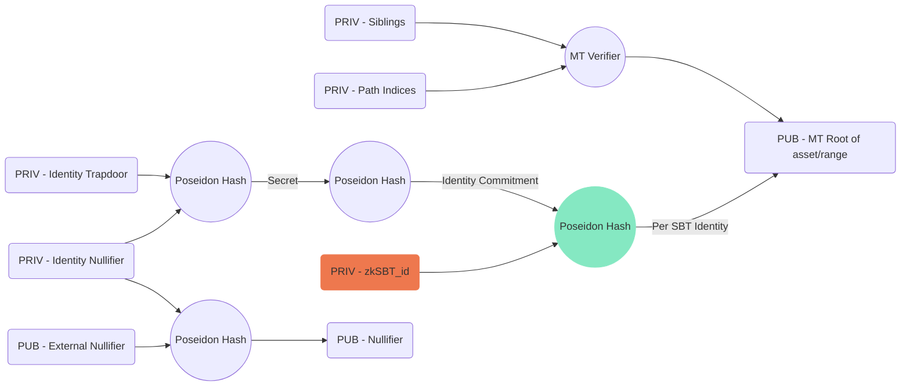
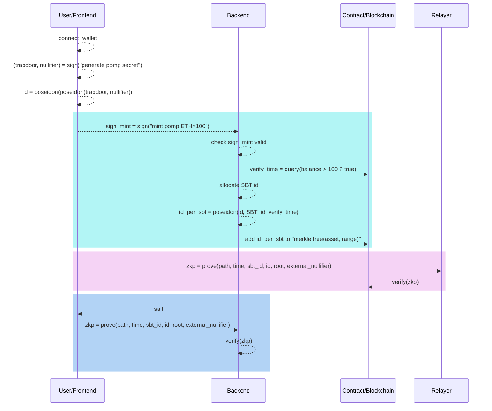

# POMP : asset possession privacy prove with semaphore

| version | description  | date       |
| ------- | ------------ | ---------- |
| 0.5     | design draft | 2023-06-21 |
| 0.6     | review       | 2023-06-26 |

$V0.6$ : @francisco @qihuang @victor

- verify time can be decide by merkle tree root, thus no need in circuit!
- proof key can be zkp with specific salt
- public mint is acceptable.
- consider zkAddress/ethereum identity compatible

<!--

Proof Key : web2 entrancy ?

## TODO

1. repo:p0x(eth) vs manta
3. Product : batch mint NFT! bind to identity.
    * POMP : not ERC721 ? how to render in collection, like opensea?
4. Semaphore-Native ?
5. only membership? no signal user case.
6. proof key？1-time zk proof ?

8. why merkle tree ? if
10. Backend : what can be done in Backend? what can not.


-->

## Overview

&emsp;&emsp;[POMP](https://twitter.com/AppPOMP)(Proof Of My Possessions) is an <font color=Red>online</font> <font color=Blue>private</font> asset verifier : Prove your assets without revealing addresses, ensuring privacy and data protection.

&emsp;&emsp;Suppose Alice has an ethereum account with balance more than 100, and she want to prove the position, probably many times.

&emsp;&emsp;A Native Solution is "record the position" as a NFT, and show the NFT to prove. Problem is how to isolate the NFT and ethereum Address, and at the same time prove ownership to the NFT.

&emsp;&emsp;We will demostrate how to promote semaphore protocol to prove ownership of the position without reveal the identity, and also best practice for fee-less verification with an offchain verify server.

## Proof Key

[zkAddress-based Proof Key](https://docs.manta.network/docs/concepts/proofkey) allows users to verify their identity on-chain by prove identity:

- Show the zkSBT has been minted to their identity(zkAddress).
- Show they have spending rights to that identity(zkAddress).

The deisgn could be simpler in Semaphore version :

- SBT is part of seed for generate identity
- account-specific secret is another part for generate identity.

## Semaphore

&emsp;&emsp;[Semaphore Protocol](<(https://semaphore.appliedzkp.org/)>) allows to prove group membership in merkle tree without revealing identity.

&emsp;&emsp;We have previously undertaken development based on the Semaphore protocol and attempted to optimize it.

&emsp;&emsp;[zkvote](https://zkvote.webflow.io/) zkVote leverages the membership and signal of the Semaphore protocol to achieve anonymous voting, with external nullifier to prevent replay attacks.

&emsp;&emsp;[merkle forest](https://github.com/samzkback/merkle-forest) is designed to archive elastic group, which has been involved to [semaphore V4 roadmap](https://github.com/orgs/semaphore-protocol/projects/10/views/3?pane=issue&itemId=15084394).

## Binding POMP sbt/timestamp in Semaphore

An unique Position, who also bind to a certain sbt, is defined by several parameters:

- asset type : eth/bnb..
- asset range : 100~1000, >10000, 1% whale?
- position timestamp : "Jun-21-2023 03:58:11", "block 17525512"

It would be more efficient and flexalbe to make the merkle tree per asset type/range, while postion timestamp and sbt id shoule be bind to semaphore identity.

Thus, we will make minor changes on semaphore protocol, the change is aim to resue semaphore libaries as much as possible.



## Workflow

There are several stages :

- identity derive
- mint
- on-chain verify
- off-chain verify



## identity derive

Follow Aztec's, so that we don't need key management mechinism (like snap)

- $(trapdoor, nullifier) = hash(eth\_addr.sign('generate pomp secret'))$

derive identity as semaphore:

- $id = poseidon(trapdoor, nullifier)$

derive per sbt identity:

- $sbt\_it = poseidon(id, sbt\_id, query\_time)$

<!-- How to prevent Phishing？(not our duty?) -->

## "private" Mint

1. zkSBT is non-transferable NFT, All pre-mint to server address
2. server bind to user identity after verify asset valid.
3. server add membership to merkle tree, so there is no on-chain collision.
<!-- 4. on-chain verify "user indeed want a zkSBT" by check "identity generate"? -->

## private Verify

- on-chain verifier contract.

```solidity
    enum ASSET {
        ETH,
        BNB
    }
    enum RANGE {
        RANGE_0,       // >0
        RANGE_1_10,    // 1~10
        RANGE_10_100,  // 10~100
        RANGE_100      // >100
    }
    // asset_type --> asset_range --> merkle tree)
    mapping(uint256 => mapping(uint256 => uint256)) groups;
    // external nullifier, increase per verify.
    mapping(uint256 => uint256) salts;

    function verifyProof(
        uint256 asset,
        uint256 range,
        uint256 time,
        uint256 sbt_id,
        uint256[8] calldata proof
    ) returns (bool)

```

- off-chain verify.

```typescript
interface IPomp {
  getSalt: (id: number, asset: number, range: number) => Promise<number>;
  verifyProof: (id: number, asset: number, range: number) => Promise<number>;
}
```

## Merkle Forest

&emsp;&emsp;Merkle Tree With depth 20 has 1M capability, probably still not enough, as there are 100M+ ethereum account, and still growth without an upper limit, fixed-size merkle tree is not scalable.

&emsp;&emsp;That's why we proposal merkle forest, pomp could be a real use case for more convincing demostrate.

## Manta-wallet/ethereum compatilbe

isolate select zkAddress, or identity.

## Demo V1 Schedule

1. Design Review
   - v0.5 : 2021-06-26?
2. Circuit
   - changes to semaphore
3. Contract
   - Multi Group
   - EAG Group
4. SDK
   - identity generate
   - semaphore wrapper
   - browser-compatible
5. Frontend(Partial Re-using polkadot?)
   - integrate SDK
6. Backend(Partial Re-using polkadot?)
   - mint zkSBT.
7. Relayer(Partial Re-using polkadot)
8. New Design ? Frontend

| Task  | Schedule   | People              |
| ----- | ---------- | ------------------- |
| 1~4   | 3~4 weeks  | Sam                 |
| 5~7   | 3 weeks    | Qihuang, Click, Sam |
| 8     | ?          | Yeye, Click         |
| other | NPO items? |                     |
